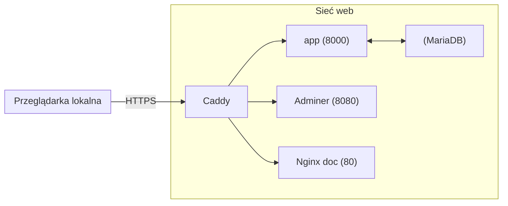

# Dokumentacja projektu – Konteneryzacja i orkiestracja usług IT
**Autor:** Marcin Łagódka  
**Data:** 06.02.2026  

---

## 1. Cel i zakres
Projekt przygotowuje spójne środowisko wielokontenerowe spełniające wymagania zaliczenia: baza danych, aplikacja korzystająca z DB, co najmniej jedna usługa dostępna przez przeglądarkę, konfiguracja w `docker-compose.yml` oraz dokumentacja. 

W skład wchodzi: **MariaDB**, **aplikacja web python**, **Adminer**, **Grafana**, **Nginx (docs)**, **Caddy (reverse proxy + TLS internal)**.

---

## 2. Architektura
Poniżej znajduje się diagram architektury w Mermaid (do podglądu na GitHub/VS Code).

## 3. Uruchamianie
Projekt uruchamiamy za pomocą docker compose. Konieczne jest ustawienie zmiennych środowiskowych. Projekt zakłada, że zmienne środowiskowe znajdą się w pliku ".env".
Wymagane zmienne środowiskowe to:

- MYSQL_ROOT_PASSWORD — hasło użytkownika root
- MYSQL_DATABASE — nazwa tworzonej bazy danych
- MYSQL_USER — użytkownik bazy danych
- MYSQL_PASSWORD — hasło użytkownika bazy danych

- DB_NAME — nazwa bazy danych (musi być taka sama jak MYSQL_DATABASE)
- DB_USER — użytkownik bazy danych (taki sam jak MYSQL_USER)
- DB_PASS — hasło użytkownika (taki sam jak MYSQL_PASSWORD)

- GF_SERVER_ROOT_URL — HOSTNAME dla naszej Grafany